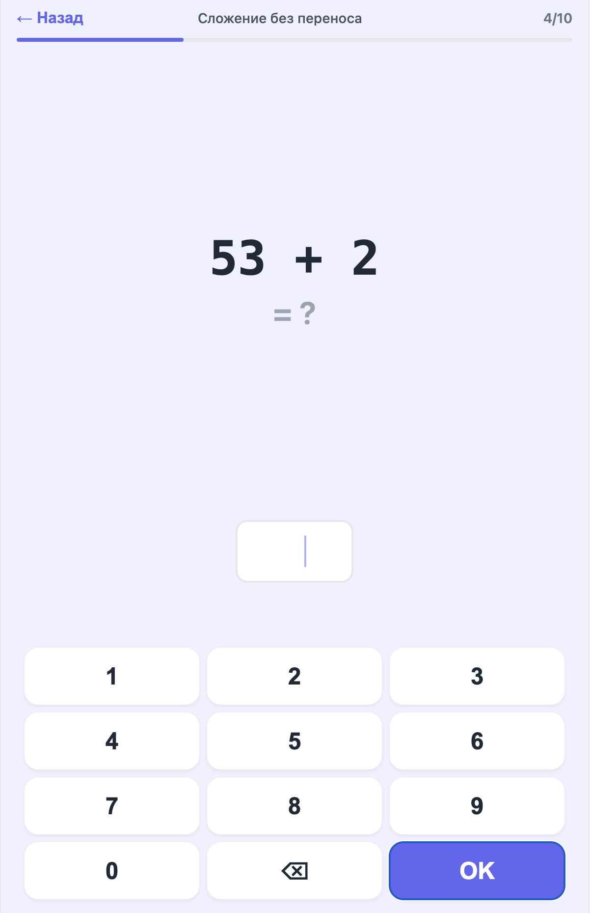
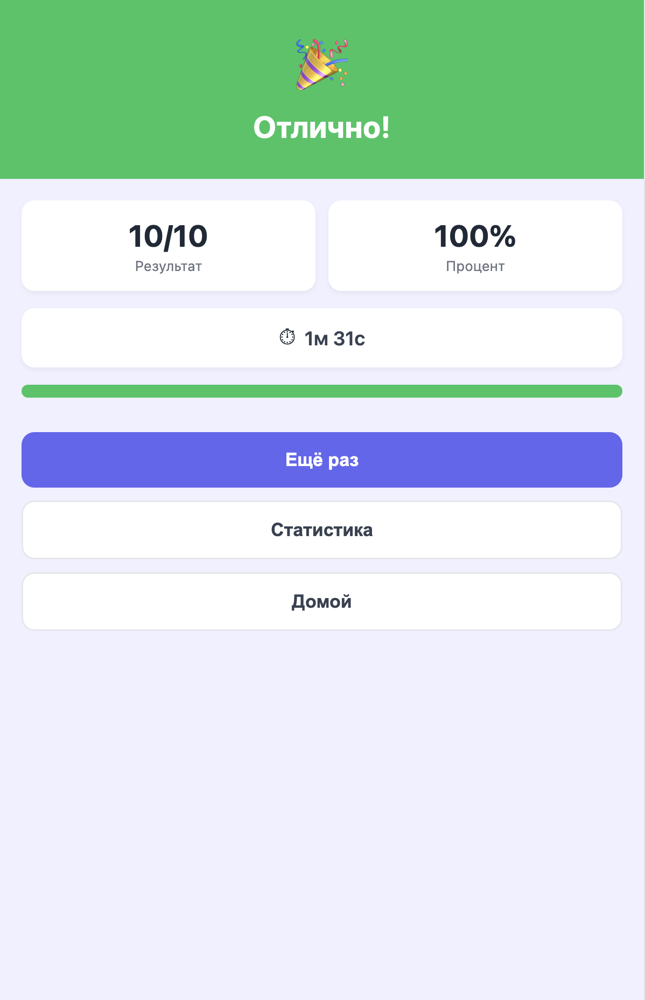
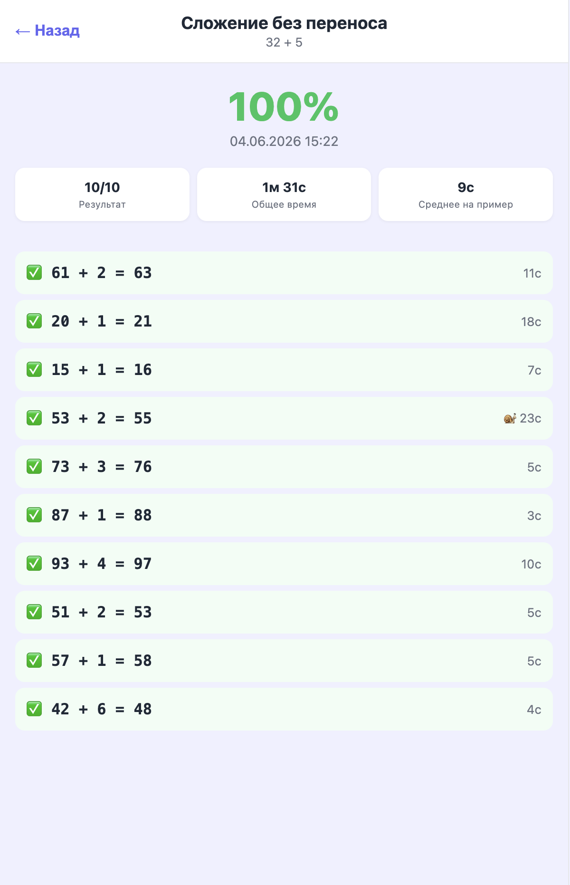
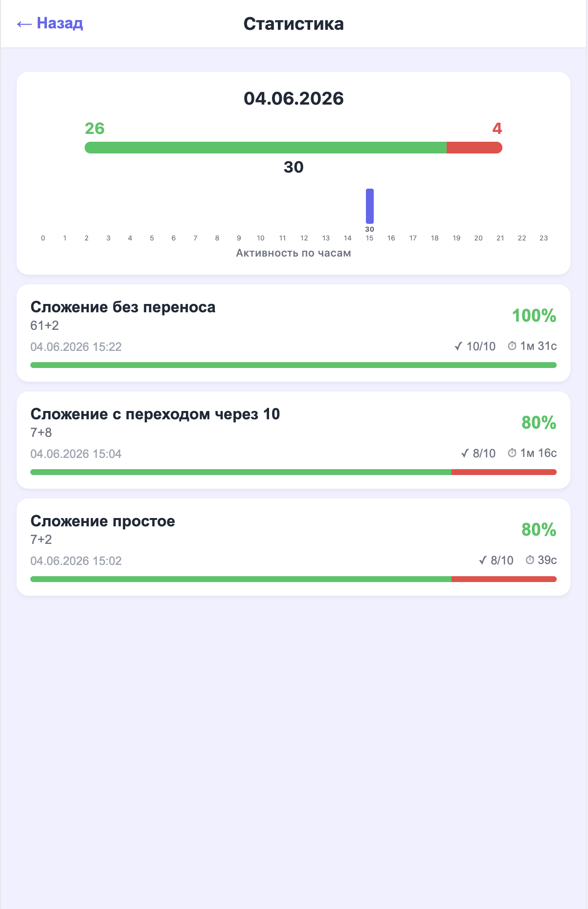
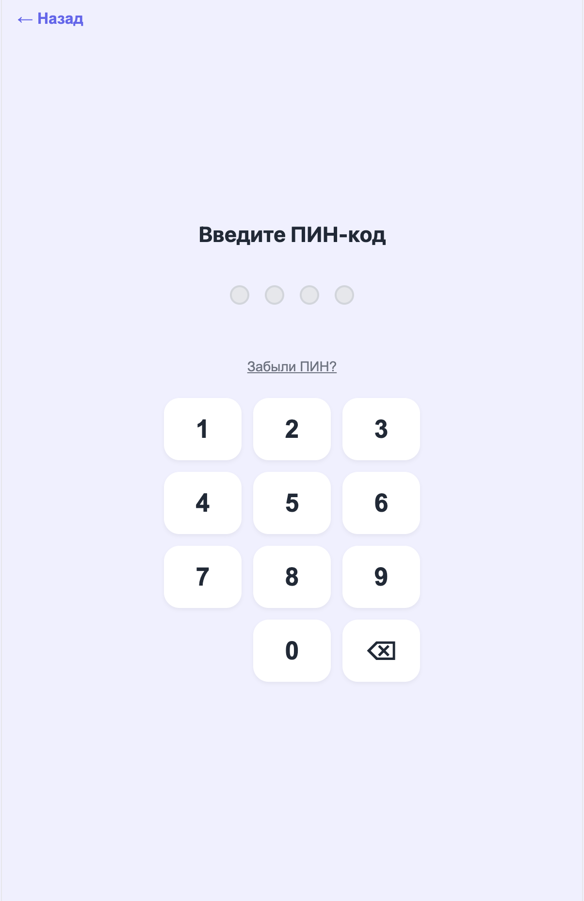
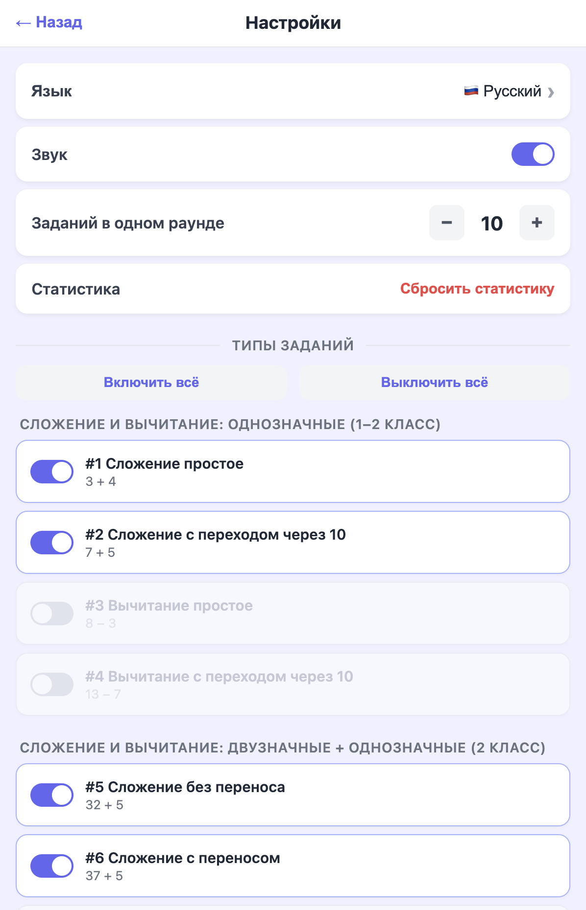
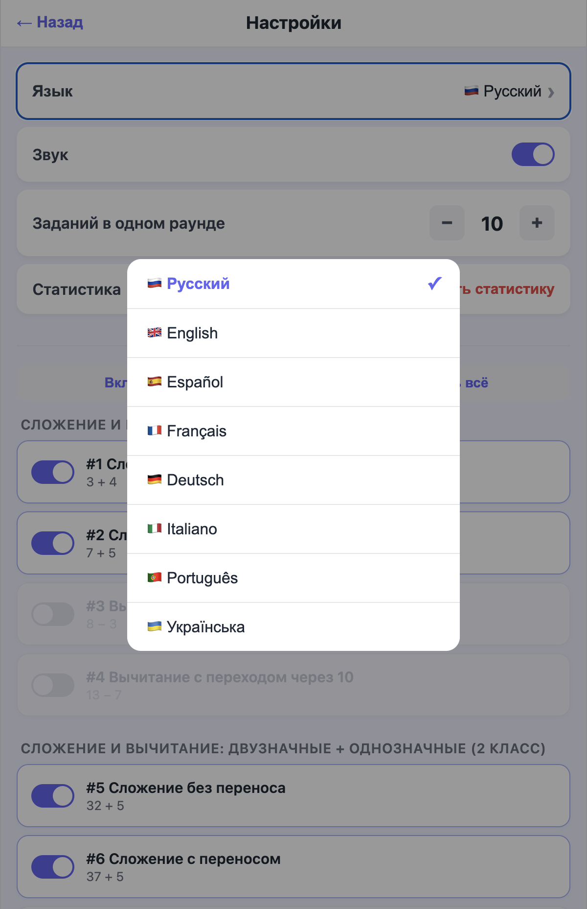

# Math Trainer

A progressive web app (PWA) for practicing mental arithmetic. Designed for kids in grades 1–4, with 55 task types, 8 languages, and detailed statistics.

## Features

- 55 task types — addition, subtraction, multiplication, division across different digit ranges
- 8 languages — Russian, English, Spanish, French, German, Italian, Portuguese, Ukrainian
- Statistics — daily contribution graph, streak tracking, hourly activity, per-test breakdown
- Parent panel — PIN-protected settings to enable/disable tasks, adjust rounds count, toggle sound, reset stats
- PWA — installable on iPad/phone home screen, works offline
- Sound effects, custom numpad, shake/spring animations

## Screenshots

   
   

## Tech Stack

React 19 + TypeScript, Vite 6 + vite-plugin-pwa, react-router-dom (HashRouter), localStorage, pure CSS.

## Getting Started

```bash
npm install
npm run dev
```

Open http://localhost:5173.

### Build

```bash
npm run build
```

Output in `dist/` — deployable to any static host.

## Deploy to GitHub Pages

### First time

1. Push the project to GitHub:
   ```bash
   git remote add origin git@github.com:slyvkanychserhii/mathtrainer.git
   git push -u origin main
   ```
2. Deploy:
   ```bash
   npm run deploy
   ```
3. Go to `Settings → Pages` on GitHub, set **Source** to `Deploy from a branch`, branch `gh-pages`, folder `/ (root)`.
4. Wait 1–2 minutes, then open `https://slyvkanychserhii.github.io/mathtrainer/`.

### Update after changes

```bash
npm run deploy
```

This builds the project and pushes `dist/` to the `gh-pages` branch. GitHub Pages auto-updates within a minute.

## Install on iPad

1. Open `https://slyvkanychserhii.github.io/mathtrainer/` in Safari.
2. Tap **Share** (square with arrow).
3. Tap **Add to Home Screen**.
4. Tap **Add**.
5. Open from home screen — it launches full-screen without browser chrome, works offline.

## PIN

Set on first Settings entry. If forgotten, clear site data via DevTools (`F12` → Application → Local Storage → delete keys `matemagic_*`).
